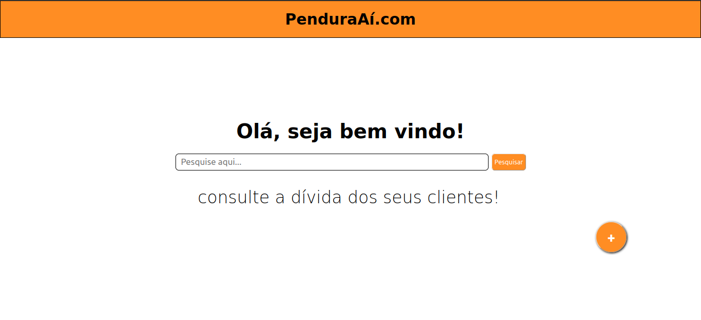
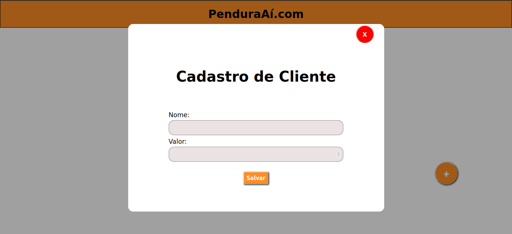
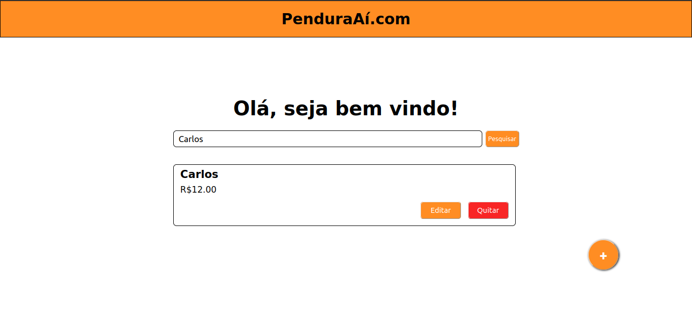
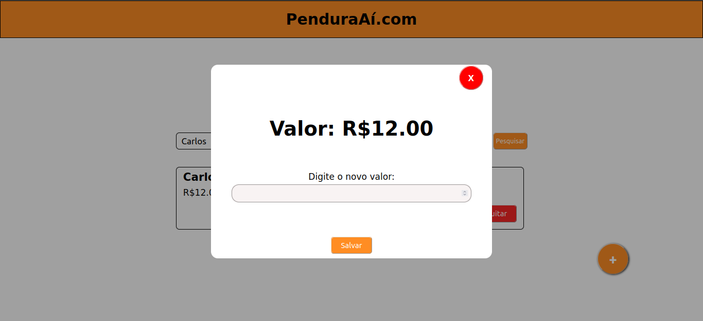

<h1>Projeto Pendura Aí</h1>
Neste projeto, eu busco agilizar um processo que é muito comum em comércios mais simples no nosso país, o famoso caderninhos de "fiados", onde é bem chato folhear várias páginas até encontrar a dívida da pessoa, fora que é difícil manter uma organização por muito tempo. Esse site agiliza isso pois guarda os seus clientes com suas respectivas dívidas no banco de dados e, quando necessário, apenas ao fazer uma pesquisa você encontra o nome que deseja. É uma solução simples e funcional que pode ajudar muitos empreendedores.

<h3>Tecnologias:</h3>
<ul>
 <li>React + TypeScript</li>
 <li>Spring Boot</li>
 <li>PostgreSQL (Banco de Dados)</li>
 <li>Docker</li>
</ul>

<h3>Imagens:</h3>
<h4>Home</h4>

<h4>Cadastro de Cliente</h4>

<h4>Pesquisa</h4>

<h4>Atualização do valor da dívida</h4>

<h2>Como rodar:</h2>

 1 - Clone este repositório

 
 2 - Certifique-se de possuir Docker Desktop/Docker Engine na sua máquina

 
 3 - Ao acessar o diretorio onde está o docker compose, digite o comando no terminal 

`docker compose up -d`
